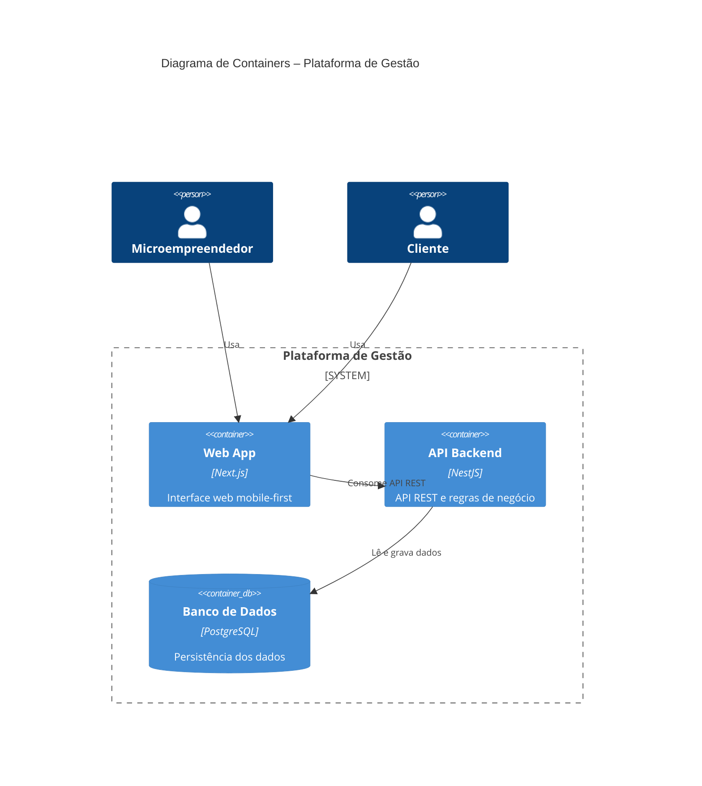

# C4 – Diagrama de Containers

```mermaid
C4Container
title Diagrama de Containers – Plataforma de Gestão

Person(admin, "Microempreendedor")
Person(client, "Cliente")

System_Boundary(system, "Plataforma de Gestão") {
    Container(web, "Web App", "Next.js", "Interface web mobile-first")
    Container(api, "API Backend", "NestJS", "API REST e regras de negócio")
    ContainerDb(db, "Banco de Dados", "PostgreSQL", "Persistência dos dados")
}

Rel(admin, web, "Usa")
Rel(client, web, "Usa")

Rel(web, api, "Consome API REST")
Rel(api, db, "Lê e grava dados")
```
